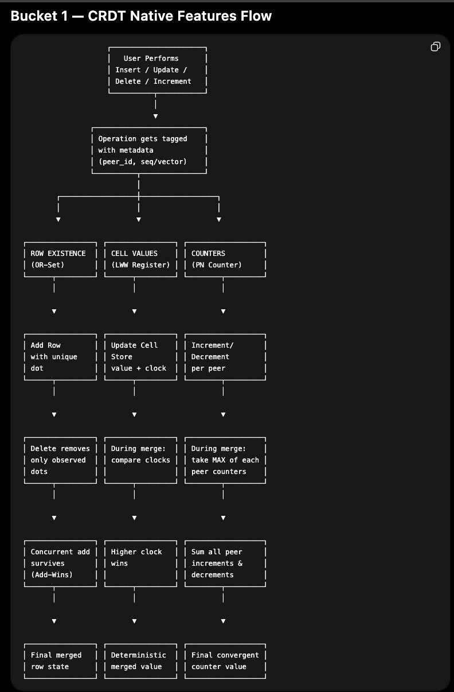

# anvil_p01_crdt_study_guide

# ANVIL Hackathon — Problem 01: Conflict-Free Collaborative OLTP

## Complete Study Guide for Audio Learning

### Python-First Approach · 24-Hour Hackathon · Bangalore

---

# PART ONE: THE BIG PICTURE — WHAT IS THIS PROBLEM ASKING?

## The One-Line Summary

Build a database that works like SQLite on the outside, but internally uses a
special merging system so that multiple people can write to it simultaneously
without an internet connection, and when they reconnect, all their data merges
correctly — automatically, deterministically, without any fights about who was
right.

## Why Does This Problem Exist?

Think about Google Docs. When two people edit the same document simultaneously,
Google’s servers decide what the final version looks like. The server is the
boss. The server is always online. The server has the final say.

Now imagine you remove the server entirely. Two laptops. Both offline. Both
writing to the same database. An hour later they connect to each other over a
cable. Who wins? What is the final state? How do you even know?

This is the problem. And it is unsolved for relational databases. It has been
solved for simple things — a counter, a text document, a shopping cart. But not
for a database with tables, foreign keys, unique constraints, and secondary
indexes. That is what you are building.

The problem statement calls this “local-first.” Your device is the primary
copy. The network is just a sync relay — a convenience, not a requirement. The
database must work fully offline, sync when possible, and never lose data or
produce inconsistent results.

## The Commercial Context — Why Judges Care

The problem statement explicitly says this is “a real systems problem with a
real commercial wedge.” It names four existing products — Replicache, ElectricSQL,
PowerSync, and Y-sweet — and says each of them ships a partial answer. The full
relational story is open. What you are building is literally a startup idea
wrapped in a hackathon problem. The judges are not just checking if your code
runs. They are checking if you understand the design space well enough to defend
your choices. This is why the writeup is worth 25 out of 100 judging points.

---

# PART TWO: THE THEORY — WHAT IS A CRDT?

## Starting From First Principles

Imagine you and a friend are each keeping a shopping list on your own notebook.
You are on a long flight. No phone signal. You both write things down
independently. When you land, you want to combine your lists into one master
list.

For a simple list, merging is easy — just combine everything, remove duplicates.
But now imagine your list is a relational database with rules. You cannot add
an order without a customer existing. You cannot have two customers with the
same email. And one of you may have deleted a customer while the other was
adding an order for that customer. Now merging is very hard.

A Conflict-free Replicated Data Type, or CRDT, is a mathematical approach to
data structures that guarantees you can always merge, and the result is always
the same regardless of the order you merge in.

## The Three Mathematical Properties You Must Internalize

Every CRDT merge function must satisfy three properties. You will be asked
about these in the live Q and A. Understand them deeply.

**Property One: Commutativity**
Merge of A and B equals merge of B and A. The order you merge in does not
matter. If Peer A syncs with Peer B, or Peer B syncs with Peer A, the result
is identical. This is critical because in a distributed system, you cannot
control who initiates a sync.

**Property Two: Associativity**
Merge of (merge of A and B) with C equals merge of A with (merge of B and C).
The grouping of merges does not matter. If you have three peers syncing in
stages, it does not matter which two sync first. The final result is the same.

**Property Three: Idempotency**
Merge of A with A equals A. If you accidentally sync twice, or receive a
duplicate message, nothing breaks. The result is the same as merging once.

These three properties together mean something powerful: no matter how chaotic
the network is, no matter how many times messages are duplicated or reordered,
as long as eventually every peer has seen every other peer’s updates, they will
all converge to exactly the same state.

This is what the ANVIL judges test with their chaos mode — they reorder all the
sync operations randomly and verify that your final hash is identical to the
canonical run.

## State-Based vs Operation-Based CRDTs

There are two flavors of CRDTs. You need to understand both because your engine
will use elements of each.

**State-Based CRDTs** work by sharing entire states and merging them. Peer A
sends its full database state to Peer B. Peer B merges it with its own state
using the merge function. The advantage is simplicity. The disadvantage is
bandwidth — you are sending a lot of data every time.

**Operation-Based CRDTs** work by sharing operations — the individual writes
that happened. Instead of sending the whole state, you send “I did this insert,
then this update, then this delete.” The advantage is efficiency. The
disadvantage is that your replication protocol must guarantee every operation
is delivered exactly once in causal order, which is complex.

For a 24-hour hackathon in Python, you should use state-based CRDTs. The
approach is simpler, easier to reason about, and easier to test. The ANVIL
bench does pairwise sync, which maps perfectly to the state-based approach.

## Vector Clocks — The Time-Keeping Mechanism

Since you have no shared clock between peers — no internet, no NTP, no
synchronized time — you need a logical clock. The standard tool is a vector
clock.

A vector clock is simply a dictionary mapping each peer’s ID to a sequence
number. For example: {“A”: 3, “B”: 1, “C”: 0} means “Peer A has done 3
operations, Peer B has done 1, and Peer C has done none.”

When Peer A does an operation, it increments its own counter: {“A”: 4, “B”: 1,
“C”: 0}. When Peer A syncs with Peer B, they exchange vector clocks and merge
them by taking the maximum of each entry.

Vector clocks let you determine causality. Clock X dominates clock Y if every
entry in X is greater than or equal to the corresponding entry in Y. This means
X happened after Y. If neither dominates the other, the operations are
concurrent — they happened independently without knowledge of each other. This
is when conflict resolution kicks in.

**Critical constraint from the problem statement:** Vector clocks must be
bounded by O(writers) — the number of distinct peers that have written a
particular row. Not O(writes) — the total number of write operations on that
row. This means when Peer A writes to a cell 100 times, you do not store 100
entries. You store one entry for A, and you overwrite it each time. Only one
entry per peer, ever. If your implementation grows vector clocks with each
write operation rather than each unique writer, you are auto-disqualified.

---

# PART THREE: THE PROBLEM STATEMENT — SECTION BY SECTION

## What You Must Build: The External Interface

The problem says your engine must look like SQLite from the outside. Specifically:

You must support CREATE TABLE with a primary key and at least one secondary
index. You must support INSERT, UPDATE, and DELETE across multiple concurrent
peers without any coordinator. Your range queries must return a deterministically
merged result regardless of what order peer updates were applied. Foreign key
cascades must work with a chosen, documented, defended semantics — not silence.
Uniqueness constraints must be enforced via an explicit escrow or reservation
protocol. And you need a pairwise sync protocol with bounded metadata and a
written argument for eventual convergence.

For the hackathon, you ship this as either an embedded library or a local daemon.
Since you are using Python, the embedded library approach is much simpler — just
a Python class that other code imports and calls directly.

## The Reference Schema — This is What Judges Test Against

Every team is tested against the same schema. Here it is:

A users table with columns: id (text, primary key), email (text, not null,
unique), and name (text).

An orders table with columns: id (text, primary key), user_id (text, not null,
references users id with on delete cascade), status (text, not null), and
total_cents (integer, not null, default 0).

And a secondary index: orders by user on orders with columns user_id and status.

This schema is not random. It is specifically designed to test every hard case.
The unique email constraint forces you to implement the uniqueness protocol. The
foreign key with cascade forces you to declare and implement your FK policy. The
secondary index forces you to maintain index consistency across concurrent
writes. The integer total_cents is there because cell-level conflict resolution
on numeric types has specific semantics.

## The Reference Scenario — This is the Exact Sequence Judges Run

Three peers: A, B, and C. All start empty and disconnected.

Step one: Peer A inserts user u1 with email alice@x.com and name Alice. Peer A
also inserts user u2 with email bob@x.com and name Bob.

Step two: Peer B, still offline and independent, inserts user u3 with email
alice@x.com and name Alice-prime. This creates a uniqueness conflict on email —
both A and B have inserted a user with alice@x.com but in isolation.

Step three: Peer C receives a one-way sync from Peer A. So C now knows about u1
and u2 but nothing from B.

Step four: Peer C, now knowing about u1, deletes user u1. This is the parent
delete.

Step five: Peer A, still not knowing about C’s delete, inserts order o1 which
references u1 as its user. This is the child insert versus deleted parent
conflict.

Step six: Peer A updates the name column of user u1 to Alice Cooper.

Step seven: Peer B updates the email column of user u1 to alice@ex.org. This is
the cell-level conflict — two peers updating different columns of the same row
concurrently.

Then pairwise syncs happen: A with B, B with C, A with C, repeating until
quiescent — meaning no more changes propagate.

## The Five Assertions Judges Check

After the reference scenario, judges check five things:

**Assertion One:** The merged state must be bit-identical across Peers A, B, and
C, verified by snapshot hash. Every peer must have exactly the same data.

**Assertion Two:** The uniqueness invariant on users.email must hold. The winning
row between u1 (alice@x.com from A) and u3 (alice@x.com from B) must be
documented. The losing row must be recoverable — not silently deleted.

**Assertion Three:** The foreign key behavior for order o1 against the deleted
user u1 must be documented and consistent with your stated semantics. You pick
cascade, tombstone, or orphan. The judges just check that what you pick matches
what actually happens.

**Assertion Four:** Cell-level merge on user u1 must preserve both updates — the
name change from A and the email change from B — without whole-row last-writer-wins.
This means you cannot just say “the latest write to the row wins.” You must
resolve at the individual column level.

**Assertion Five:** Convergence must be invariant under sync ordering. The judges
run your scenario again with a random seed reordering the syncs. The final hash
must be identical.

---

# PART FOUR: THE THREE BUCKETS — YOUR ARCHITECTURAL FRAMEWORK

This is the most important section for your writeup and your live defense. The
problem explicitly asks you to categorize relational invariants into three
groups. Here is each group in detail.

## Bucket One: Natively CRDT-Expressible

These features map cleanly to existing CRDT primitives. You implement them with
merge functions and they just work.

**Row existence — OR-Set semantics**
A table is a set of rows. Each row has an ID. The presence or absence of a row
is tracked using an Observed-Remove Set, or OR-Set. The key insight of an
OR-Set: when you add something, you tag it with a unique dot — a (peer_id,
sequence_number) pair. When you delete something, you remove the specific dots
you have observed. If a concurrent add happens with a dot you have never seen,
that add survives the delete. This is called add-wins semantics.

In Python: each row stores a set of dots representing “evidence of existence.”
A row exists if its dot set is non-empty. Deleting a row means removing the dots
you know about. If another peer added a dot you never saw, the row survives.

**Cell values — Last-Writer-Wins Register**
For individual cell values (a column in a row), the simplest CRDT is a
Last-Writer-Wins register. Each cell stores (value, vector_clock). On merge,
the cell with the higher vector clock wins. If clocks are concurrent — neither
dominates — you need a deterministic tiebreak. The safest tiebreak for a
hackathon: compare peer IDs lexicographically. Peer A always beats Peer B on
ties, consistently. Document this choice. Defend it. It is an acceptable
semantic — it does not lose data in theory, it just picks a winner, and the
problem does not require you to flag every concurrent cell update as a conflict.

**Cell values — Multi-Value Register (Stretch)**
A more sophisticated approach is to keep all concurrent values and surface them
as a conflict for the application to resolve. This is what the problem calls a
multi-value register. For the hackathon, LWW with deterministic tiebreak is
sufficient. Multi-value register is a stretch goal.

**Monotonic counters**
The total_cents column is an integer. If two peers increment it independently,
you do not want last-writer-wins — you want both increments to count. A PN-Counter
(Positive-Negative Counter) tracks increments and decrements per peer separately
and sums them. On merge, you take the maximum of each peer’s increment counter
and maximum of each peer’s decrement counter. This gives you a convergent
integer that respects all concurrent changes.

However, the problem does not specifically require PN-Counter behavior — it just
requires the column to exist. For the judged scenario, using LWW on total_cents
is acceptable as long as you document it and note the trade-off.

## Bucket Two: Requires Lattice-Respecting Encoding

These features need more careful design. They do not break convergence, but they
require specific data structures to handle correctly.

**Deletes — Tombstones**
When a row is deleted, you cannot just remove it from your dictionary. If you
do, and then you sync with a peer that does not have the delete, that peer’s
version of the row will survive the sync — because there is nothing in your
state to say “this row was intentionally deleted.” You need a tombstone.

A tombstone is a marker that says: this row ID was explicitly deleted. It carries
a dot — the (peer_id, seq) that performed the delete — and a timestamp. On merge,
if a row ID appears in both the live rows of one peer and the tombstones of
another, you must resolve the conflict. The default is: delete wins. But you can
choose add-wins if you document it.

**The Concurrent Delete-Insert Problem — The Core of the Reference Scenario**
This is the hardest case and it is directly in your reference scenario. Peer C
deletes u1. Peer A inserts order o1 referencing u1, and also updates u1’s name.
Neither knows what the other has done.

When they sync, what happens? Your engine must have a definitive answer based
on your declared FK policy. There is no “correct” answer — there are three
defensible answers — but you must pick one and implement it consistently for
every table and every run.

**Secondary Index Consistency**
When you have an index on orders(user_id, status), and two peers concurrently
insert orders for the same user, the index must reflect the merged state. This
means your index is not a separate data structure you maintain independently.
It is derived from the merged row state. You rebuild or incrementally update it
after every sync. For a hackathon, rebuilding from scratch after each sync is
totally acceptable — just iterate over all orders in the merged state and
reconstruct the index.

## Bucket Three: Fundamentally Requires Coordination — The Hard Part

These features cannot be implemented with pure CRDTs. They need a protocol
decision that goes beyond just merging.

**Uniqueness Constraints — The Escrow Protocol**

This is explicitly called out in the problem. The problem says: “Pure CRDTs
cannot do uniqueness. Address it directly.”

Here is why pure CRDTs fail: Peer A inserts a user with email alice@x.com. Peer B,
offline and independently, inserts a different user with email alice@x.com. Both
are valid locally. When they merge, you have two rows claiming the same unique
column value. A merge function that just takes the union of rows cannot help —
it has no way to know which one should survive.

There are two approaches to the escrow protocol for a hackathon:

**Approach One: Reservation before insert (true escrow)**
Before a peer can insert a row with a unique value, it must “reserve” that value
by broadcasting a reservation token. Other peers that see the reservation cannot
use that value. This requires network communication before the insert, which
breaks offline capability. This is the real escrow protocol. It is too complex
for a 24-hour hackathon.

**Approach Two: Conflict detection on merge with deterministic winner (hackathon-viable)**
Allow both inserts to happen offline. On merge, detect the conflict — two rows
with the same email. Apply a deterministic rule to pick the winner. The loser is
tombstoned but kept in a conflict log so it is recoverable. The winner survives.

The deterministic rule must be documented and consistent. The simplest: compare
(peer_id, insert_timestamp) lexicographically. The lexicographically smaller one
wins. Or compare row IDs if they are UUID-like. Whatever you choose, the same
rule must apply every single time — the result must be the same whether you merge
A into B or B into A.

This approach means your uniqueness constraint is “eventually unique” — during
the offline period, both peers can have the same email. After sync, exactly one
survives. For most real applications this is acceptable. For a hackathon, it is
completely defensible as long as you explain the trade-off clearly in your writeup.

**Foreign Key Existence Under Deletion — The Policy Declaration**

The problem says you must declare exactly one FK policy. You cannot mix policies.
You cannot pick per-table. One policy, all tables, every run. Here are the three:

**Cascade:** When a parent row (user u1) is deleted, all child rows (orders
referencing u1) are also deleted. This is the easiest to implement — just
propagate the delete. But the problem is: what if a concurrent child insert
happened that you do not know about? Peer A inserts order o1 for u1. Peer C
deletes u1. When they merge, with cascade policy, o1 is deleted — even though
Peer A inserted it legitimately. Data loss. You must defend this trade-off in
your writeup.

**Tombstone:** When a parent row is deleted, it becomes a tombstone — kept in
metadata, logically deleted but referentially alive. Child rows survive. Queries
see the child rows. The engine documents that the parent is tombstoned. This is
the most defensible choice. It does not lose data. The child o1 survives. User
u1 exists as a tombstone — you know it was deleted, you know when, you know by
whom. Queries that join users and orders will see o1 but can check that u1 is
tombstoned. This is the recommended policy for your hackathon submission.

**Orphan:** When a parent row is deleted, child rows survive but their foreign
key column (user_id) is set to NULL or a sentinel value. The relationship is
severed. This is also defensible — the child row is preserved, just disconnected
from its parent. The downside is you lose the ability to trace which user an
order belonged to. For an e-commerce scenario, this is harder to defend than
tombstone.

**Recommendation:** Choose tombstone. It preserves the most data, it is the
easiest to explain, and it handles the reference scenario cleanly. Order o1
survives. User u1 exists as a tombstone. Both assertions three and four are
satisfied. You declare tombstone via the command line flag: –fk-policy tombstone.

---

# PART FIVE: THE SYNC PROTOCOL

## What Pairwise Sync Means

The ANVIL bench calls sync(peer_a, peer_b) and expects both peers to reflect
each other’s state after the call. This is bidirectional — not master-slave.
Peer A sends its state to Peer B and Peer B sends its state to Peer A,
simultaneously. After the call, both must have merged all changes from both
sides.

In Python, your sync method receives two peer IDs. You look up the full state
of each peer. You merge them bidirectionally. Both states are updated in place.

## What “Bounded Metadata” Means

The problem says sync metadata per row must be bounded by O(writers). This
means: for a row that has been written by three distinct peers (A, B, C), the
metadata — vector clocks, dot sets — must have at most three entries. Not three
entries per write operation. Three entries total, one per peer.

If Peer A writes to user u1 fifty times, your vector clock for u1 still has
only one entry for A. You overwrite the previous entry with the new one. The
metadata size is proportional to the number of distinct writers, not the number
of writes. This is the key distinction between O(writers) and O(writes).

## Garbage Collection — Part of the Protocol, Not an Afterthought

The problem explicitly says this. Tombstones cannot grow forever. Once you are
certain that all peers in the system have seen a tombstone — meaning the
deletion has fully propagated — you can remove the tombstone from active memory.
This is called garbage collection of tombstones.

For the hackathon, you do not need a full GC implementation, but you must
acknowledge it in your writeup. A simple approach: tombstones older than a
configurable threshold and confirmed seen by all known peers can be pruned. The
bench test does not specifically test GC — it tests that your metadata does not
grow with write count, which is the vector clock constraint above.

## Convergence Argument — What You Need to Write

Your writeup must include “a written argument for eventual convergence.” This
does not need to be a formal proof. An informal but rigorous argument is what
the problem asks for. Structure it as:

State that your merge function is commutative: prove it by showing merge(A,B)
and merge(B,A) produce the same result for each data structure (OR-Set, LWW
register, tombstone set).

State that your merge function is associative: same approach.

State that your merge function is idempotent: merging a state with itself
returns the same state.

Conclude that by the standard CRDT convergence theorem, any two peers that
have seen the same set of operations will converge to the same state, regardless
of the order those operations were applied.

---

# PART SIX: THE ANTI-PATTERNS THAT WILL DISQUALIFY YOU

## Anti-Pattern One: Server-Authoritative Conflict Resolution

If when two peers conflict, your engine sends a request to a server to decide
the winner, you are disqualified. There is no server. The whole point is that
the engine itself resolves conflicts based on its data structures and merge rules.
If you use a SQLite database on a server as the source of truth, you are
disqualified. SQLite as a local read-side cache is fine — you can use SQLite to
store each peer’s local state on disk — but it cannot be the arbiter of truth.

## Anti-Pattern Two: Row-Level Last-Writer-Wins

If your conflict resolution works at the whole-row level — meaning “the latest
write to this row wins” — you fail assertion four of the reference scenario. Peer
A and Peer B update different columns of the same row (name vs email). If you
use row-level LWW, you keep only one of those updates. The problem says cell-level
resolution is the minimum acceptable. Each column must be resolved independently.

## Anti-Pattern Three: Unbounded Metadata

Vector clocks that grow with the number of writes — not the number of writers —
are auto-disqualifying. Make sure your implementation overwrites vector clock
entries for a peer rather than appending new entries.

## Anti-Pattern Four: Hardcoded Hashes

The bench is explicitly designed to resist this. The L2 property-based tests
generate fresh random operations per seed. You cannot hardcode the expected hash
because the expected hash is unknown until the run. Your engine must actually
converge correctly for arbitrary operation sequences, not just the canonical one.

---

# PART SEVEN: PYTHON IMPLEMENTATION APPROACH

## Why Python is Fine

The problem says “any language with strong type discipline.” Python with type
hints qualifies. The bench harness is pure Python stdlib. Your adapter shim is
Python. Your engine can be Python. The only performance concern is the chaos
test with 5 peers and 150 random operations — but this is trivially fast for
in-memory Python dicts.

## The Data Structures in Python

Think of your engine as a class called CRDTEngine. It holds a dictionary called
peers, mapping peer_id strings to peer state objects.

A peer state contains:

tables — a dictionary mapping table_name to a dictionary of row_id to row data.

dots — a dictionary mapping table_name to a dictionary of row_id to a set of
(peer_id, seq) tuples. These are the OR-Set dots proving the row exists. A row
exists if its dot set is non-empty after merging.

tombstones — a dictionary mapping table_name to a dictionary of row_id to
tombstone metadata (who deleted it, when, their vector clock at deletion time).

cells — nested inside each row, a dictionary mapping column_name to a tuple of
(value, {peer_id: seq}). This is the LWW register per cell.

unique_index — a dictionary mapping (table_name, column_name, value) to a tuple
of (row_id, peer_id, insert_seq). This is used for uniqueness enforcement.

seq_counters — a dictionary mapping peer_id to the current sequence number for
that peer. Every time a peer does an operation, its counter increments.

## The Seven Adapter Methods

The bench requires exactly seven methods. Here is what each one does:

**open_peer(peer_id):** Create a fresh, empty peer state for this peer_id in
your engine’s peers dictionary. This is called once per peer before anything else.

**apply_schema(peer_id, stmts):** Execute CREATE TABLE and CREATE INDEX statements
for this peer. Parse the SQL minimally — you need to extract table names, column
names, primary key declarations, unique constraints, and foreign key references.
You do not need a full SQL parser. Just look for the keywords you need.

**execute(peer_id, sql, params):** Execute an INSERT, UPDATE, DELETE, or SELECT
against this peer’s local state. This is the core of your engine. For INSERT,
add the row with a fresh dot. For UPDATE, update specific cells with a new vector
clock entry. For DELETE, tombstone the row. For SELECT, read from the merged
local state.

**sync(peer_a, peer_b):** Bidirectionally merge the states of peer_a and peer_b.
Both peers get updated. This is where your merge function runs.

**snapshot_hash(peer_id):** Serialize this peer’s full state to a canonical,
deterministic string and return its SHA256 hash. Canonical means: always sorted
keys, always same order, always same format. Use Python’s json.dumps with
sort_keys=True, then hashlib.sha256. The hash is what judges compare across
peers to verify convergence.

**snapshot_state(peer_id):** Return the full state as a dictionary — all tables,
all rows, all metadata. This is used by judges to inspect the actual merged data.

**close():** Shut down all peers. For an in-memory engine, this just clears the
peers dictionary.

## The Merge Function — Step by Step

When sync(peer_a, peer_b) is called, you run this process:

Step one: For each table, collect all row IDs seen by either peer — the union
of both peers’ row IDs including tombstoned ones.

Step two: For each row ID, merge the dot sets. The merged row exists if the
union of dot sets is non-empty after removing dots that are dominated by tombstones.

Step three: For each row that exists in both peers’ live state, merge each cell
independently. For each cell, compare the vector clocks. Take the cell from the
peer with the higher clock. If clocks are concurrent, apply your deterministic
tiebreak (lexicographic on peer_id is simplest).

Step four: Merge tombstone sets. A tombstone from either peer propagates to both.

Step five: Re-evaluate uniqueness constraints. For each unique column across all
tables, check for conflicts in the merged live rows. For any duplicate unique
value, apply your deterministic winner selection. Tombstone the loser. Record
the conflict in a conflict log.

Step six: Rebuild secondary indexes from the merged row state.

Step seven: Write the merged state back to both peer_a and peer_b identically.

## The Snapshot Hash — Why Determinism is Critical

The hash is the ultimate test of convergence. If any two peers have the same
logical data but produce different hashes, you fail. Reasons hashes can differ
despite same logical data: Python set iteration order (sets are not ordered —
always convert to sorted list before hashing), Python dict insertion order
before Python 3.7 (use sort_keys=True in json.dumps), floating point
representation differences (avoid floats entirely — use integers), and None vs
null representation (be consistent).

The canonical serialization: dump your full state as a JSON string with
sort_keys=True at every level, ensuring lists of tuples are sorted, sets are
converted to sorted lists, and integers are integers not strings.

---

# PART EIGHT: THE WRITEUP — 25 POINTS YOU CANNOT AFFORD TO SKIP

The writeup is a 3-page PDF defending five things. Here is what to write for each:

## Section One: Lattice Choices Per Type

Explain each data type in your engine and why it forms a join-semilattice. A
join-semilattice is a set with a merge operation where the merge always produces
a least upper bound — a value that is “at least as advanced” as both inputs.

For LWW registers: the lattice is ordered by vector clock. Merge takes the
element with the larger clock. The lattice property holds because there is always
a unique least upper bound (the winner) once you apply the tiebreak.

For OR-Sets: the lattice is ordered by subset inclusion of dot sets. Merge takes
the union of dots. The union of two sets is always at least as large as either
input. The lattice property trivially holds.

For tombstone sets: same as OR-Sets. Tombstones only accumulate, never disappear
during active operation.

## Section Two: Uniqueness Protocol

Describe your approach. State that pure CRDTs cannot enforce uniqueness because
offline peers have no way to coordinate. Describe your post-merge conflict
detection: on every sync, check all unique columns for duplicates in the merged
live row set. For each duplicate, select the winner by your deterministic rule.
Tombstone the loser but keep it in a conflict log. State the trade-off: during
the offline period, the uniqueness invariant is temporarily violated, but it is
restored upon sync. This is “eventual uniqueness” — a weaker but practically
useful guarantee.

## Section Three: FK Protocol

State your declared policy: tombstone. Explain the semantic: when a parent row
is deleted, it becomes a tombstone. Child rows referencing it continue to exist.
The engine marks the parent as logically deleted but keeps its ID in the
tombstone set. Foreign key constraint enforcement during sync: a child row
referencing a tombstoned parent is valid — the reference is to a tombstone, not
a missing row. Explain why you chose tombstone over cascade (cascade loses
concurrent child inserts) and orphan (orphan loses relational traceability).

## Section Four: Sync Protocol

Describe your pairwise bidirectional sync. Explain that sync(A,B) merges both
states symmetrically — merge(A, B) produces the same result as merge(B, A) due
to the commutativity of your merge function. Describe the metadata exchanged:
full state on first sync, delta state on subsequent syncs if you have time to
implement delta optimization. State the convergence argument: because your merge
function is commutative, associative, and idempotent, repeated pairwise syncs
across any topology will eventually propagate all updates to all peers.

## Section Five: Metadata Growth Analysis

State that vector clock entries are bounded by O(writers) per cell — one entry
per unique peer that has written that cell, never growing beyond the number of
distinct writers. State that OR-Set dots are bounded by O(inserts) per row across
all peers but that dots from peers that have been “garbage collected” into the
causal context can be pruned. State that tombstones grow at most O(deleted rows)
total but are eligible for GC once all peers have confirmed seeing the tombstone.
Note that your hackathon implementation keeps tombstones in memory permanently
for simplicity, and describe what a full GC would look like.

---

# PART NINE: THE JUDGING GAUNTLET — WHAT ACTUALLY HAPPENS

## Layer One: Canonical Test

The exact reference scenario from the problem statement — three peers, the
specific sequence of inserts, updates, and deletes, followed by pairwise syncs.
The judges run this and check all five assertions. Passing this is necessary but
not sufficient.

## Layer Two: Property-Based Tests

The judges pass arbitrary random seeds to the bench. Each seed generates a fresh,
random sequence of operations. Your engine must produce a bit-identical hash
on both peers after syncing, regardless of what the seed generates. You cannot
hardcode anything. You cannot assume which operations will happen. You must
correctly implement the CRDT semantics so that any valid sequence of operations
converges correctly.

To run this yourself: python run.py –adapter adapters.myteam:Engine
–fk-policy tombstone –randomized-seeds 9999 31415 27182 16180 11235
–rand-peers 5 –rand-ops 150 –out report.json

## Layer Three: Adversarial Tests

Held-out seeds and hand-crafted edge cases at higher parameters. Not distributed
to participants. Used only at final evaluation. You cannot prepare for these
specifically — you can only ensure your implementation is genuinely correct.

## Live Q and A — 15 Minutes

Expect these questions. Prepare answers in advance:

“Why can’t you use a pure CRDT for uniqueness?” — Because pure CRDTs have no
way to prevent two offline peers from independently using the same unique value.
The merge function can detect the conflict but cannot prevent it. Enforcement
requires either pre-coordination (escrow) or post-sync conflict resolution with
a deterministic winner.

“Prove your merge function converges.” — State the three properties and explain
why your implementation satisfies each. Commutativity because you always take
union or max, never an ordered operation. Associativity for the same reason.
Idempotency because merging identical dots produces the same dot set, and taking
max of identical clocks returns the same clock.

“What happens if you have 1000 peers?” — Your metadata per row grows to O(1000)
— one vector clock entry per peer. This is still bounded. Your sync cost grows
linearly with the number of peers who have written that row. This is acceptable.

“How do you handle the case where a peer goes offline permanently?” — Its
tombstoned rows can be GC’d once all remaining active peers confirm they have
seen those tombstones. Its vector clock entries remain in metadata indefinitely
if they have written rows that still exist, but they do not grow — they are just
one entry per row per peer.

---

# PART TEN: THE 24-HOUR GAME PLAN

## Hour 0 to 3: Core Data Structures

Build the CRDTEngine class with all data structures in memory. Implement the
OR-Set for row membership. Implement the LWW register for cell values. Write the
basic insert, update, delete operations that update these structures. Do not
worry about SQL parsing yet — just hardcode the reference schema operations.

## Hour 3 to 6: Merge Function

Implement the bidirectional merge. Start with just OR-Sets and LWW registers.
Test with two peers manually: insert something on A, insert something different
on B, call sync, verify both have both rows. Then test cell-level conflicts:
update column X on A and column Y on B for the same row, sync, verify both
updates survived.

## Hour 6 to 9: Tombstones and FK Policy

Add tombstone support. When a row is deleted, add its ID to the tombstone set.
In the merge, propagate tombstones bidirectionally. Implement your chosen FK
policy — tombstone is recommended. Test the reference scenario’s delete-insert
conflict: delete parent on one peer, insert child on another, sync, verify the
child survives with the tombstoned parent.

## Hour 9 to 12: Uniqueness Protocol

Add the unique index. On every insert and sync, check for unique constraint
violations. Implement winner selection. Implement conflict logging. Test with
the reference scenario’s email uniqueness conflict.

## Hour 12 to 16: Adapter Implementation

Write the seven adapter methods. Implement minimal SQL parsing for CREATE TABLE,
INSERT, UPDATE, DELETE, and SELECT. The problem’s SQL is simple — you do not need
a full parser. Just split on keywords and extract table names, column names, and
values. Wire everything to your CRDTEngine methods.

## Hour 16 to 20: Self-Check and Debugging

Run python self_check.py –adapter adapters.myteam:Engine –fk-policy tombstone
–quick and fix everything that breaks. The most common failures will be in hash
determinism (fix by ensuring all serialization is sorted) and merge edge cases
(fix by tracing through the merge step by step with print statements).

## Hour 20 to 24: Writeup and Demo Recording

Write the 3-page PDF writeup covering the five sections above. Record the 5-minute
screen walkthrough showing the reference scenario running, the hash matching
across peers, and a brief architecture explanation. Push to GitHub.

---

# CLOSING: THE EDITORIAL NOTE FROM THE PROBLEM STATEMENT

The problem statement includes an editorial note that says this: “The interesting
code is not in the SQL parser. It is in the moments where the lattice breaks and
you have to pick — and own — a coordination protocol.”

This is the most important sentence in the entire document. The judges do not
care about your SQL parser. They do not care about your test setup. They care
about the three moments where pure CRDTs break — uniqueness, foreign key
existence under deletion, and schema migration — and how you handle each one.
They want to see that you understand why the break happens, that you made a
deliberate choice about how to handle it, and that you can defend that choice
under questioning.

Your entire submission should communicate three things: I understand the theory.
I made principled design decisions. I can explain every trade-off I accepted.

That is what wins at ANVIL.

---

*Document prepared for audio learning via NotebookLM.Problem: ANVIL P·01 — Conflict-Free Collaborative OLTPEvent: ANVIL Hackathon · 24 Hours · Bangalore · MMXXVI*