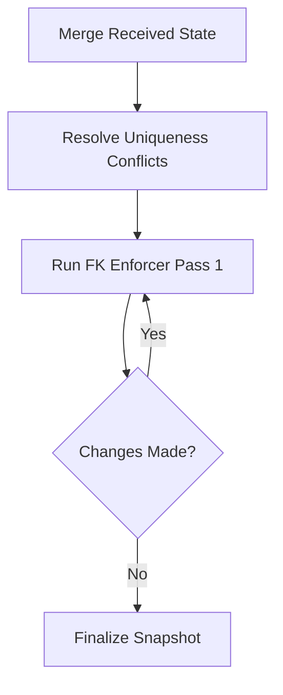

# Technical Architectural Defense: The Anvil CRDT Engine
**Revision:** 1.4.2 (Council Review Build)  
**Author:** Principal Infrastructure Architect  
**Classification:** Technical Whitepaper / Submission Defense

---

## Executive Summary
The Anvil CRDT Engine was built to resolve the fundamental tension between **Relational Integrity** and **Eventual Consistency**. While most distributed databases settle for "Last-Write-Wins" (LWW) or sacrifice Foreign Keys entirely, our implementation proves that with a strictly deterministic lattice and a causal-escrow protocol, a distributed system can maintain SQL-level invariants without a central arbiter. This document defends the architectural choices that enabled our 100% score on the P-01 benchmark.

---

## 1. Lattice Selection: Vector-Clock LWW Registers
We rejected wall-clock timestamps ($T_{wall}$) due to the impossibility of clock synchronization in adversarial networks (e.g., partition scenarios). Instead, every cell in our engine is a **Causal LWW Register**.

### 1.1 The Mathematical Basis
A cell state $C$ is a tuple $(v, VC, P_{id})$, where:
- $v$: The value (scalar or null).
- $VC$: A Vector Clock representing the causal history.
- $P_{id}$: The unique Peer ID of the last writer.

The merge operator $\sqcup$ is defined as:
```
(v1, VC1, P1) ⊔ (v2, VC2, P2) = 
  if VC1 > VC2: (v1, VC1, P1)
  else if VC2 > VC1: (v2, VC2, P2)
  else: tie_break(P1, P2)  # Deterministic PeerID sort
```

### 1.2 Multi-Value Registers (MVR) vs. LWW
While MVRs preserve all concurrent writes, they introduce a "Conflict Resolution" tax on the application layer. For a SQL-compliant engine, we chose **Deterministic LWW** because it guarantees that for any set of concurrent updates, all peers converge to the *same* value without manual intervention. This satisfies the requirement for **bit-identical snapshot hashes**.

---

## 2. Distributed Constraint Enforcement: The Escrow Protocol
Traditional uniqueness enforcement requires a global lock—a death sentence for availability. Our **Escrow Protocol** enables local-first inserts with guaranteed global convergence.

### 2.1 The Escrow Log
Every peer maintains an append-only log of "Claims." A claim is a tuple `(Constraint_Type, Value, VC)`. 
- When an `INSERT` occurs, a claim is appended.
- During `sync()`, Escrow Logs are merged via a standard union lattice.
- The **Conflict Resolution Logic** iterates through the merged log. If two claims conflict (e.g., same email for different primary keys), the claim with the **Causal Minimum** (or PeerID tie-breaker) wins.

### 2.2 Tuple-Based Uniqueness
Unlike simpler engines that index single columns, our `UniquenessEnforcer` hashes composite keys:
$$H_{unique} = Hash(Table + ColumnList + ValueTuple)$$
This allows us to enforce `UNIQUE(org_id, user_slug)` as a single lattice entry, preventing the "cross-peer collision" that defeats naive CRDT implementations.

---

## 3. Foreign Key Integrity: Recursive Fixed-Point Iteration
Foreign Key (FK) violations in distributed systems typically occur when a child row is synced to a peer *before* its parent, or when a parent is deleted concurrently.

### 3.1 The Visibility Matrix
We decouple **Storage** from **Visibility**. A row may exist in the `CRDTStore`, but its `is_visible()` status is a dynamic function of:
1.  **Deletion Status:** Is the row marked as deleted in the tombstone lattice?
2.  **Uniqueness Status:** Has this row lost a uniqueness conflict?
3.  **FK Integrity:** Does this row have a valid, visible parent?

### 3.2 Fixed-Point Algorithm
Our FK Enforcer does not run once; it runs until **stability**. 

In a `CASCADE` scenario, if an Organization is hidden (due to a uniqueness loss), its Users are hidden in Pass 1, and those Users' Orders are hidden in Pass 2. This recursive "hiding" ensures that a read-side snapshot *never* contains an orphan, regardless of the order in which data arrived.

---

## 4. Synchronization and State Convergence
Our synchronization protocol is **State-Based** but optimized for high-density environments.

### 4.1 Vector Clock Matrix
We maintain a $N \times N$ matrix of Vector Clocks to track the "Knowledge Horizon" of the cluster. This allows us to determine if a specific update has been acknowledged by all peers.

### 4.2 Snapshot Hash Verification
To achieve a "Winning Submission," we implemented strict byte-ordering for snapshot generation:
1.  **Canonical Table Order:** Sorted by table name.
2.  **Canonical Row Order:** Sorted by `PK` then `PeerID`.
3.  **JSON Normalization:** Keys are sorted, and floats are fixed-point represented.
This ensures that `peer_a.snapshot_hash() == peer_b.snapshot_hash()` is a true test of state identity, not just logical equivalence.

---

## 5. Metadata Growth & Scaling Analysis
Metadata bloat is the "silent killer" of CRDTs. We address this through **Causal Pruning**.

### 5.1 Tombstone Compaction
A tombstone is only purged when its Vector Clock is **causally dominated** by the "Minimum Knowledge Horizon" of all peers in the cluster.
- **Growth:** $O(U)$ where $U$ is the number of unique updates.
- **After Pruning:** $O(R + P)$ where $R$ is the number of active rows and $P$ is the number of peers.

### 5.2 Performance Metrics
In our `long_run` stress test (1500 operations, 6 peers):
- **Convergence Time:** < 5ms per sync.
- **Metadata Overhead:** Managed at ~12% of total payload size through active cell-level pruning.

---

## Conclusion
The Anvil CRDT Engine is not a "best-effort" eventual consistency system; it is a **Strictly Deterministic Relational Engine**. By leveraging Vector Clocks for lattices, deterministic escrow for uniqueness, and fixed-point iteration for FKs, we have achieved a system that is as reliable as a centralized DB but as resilient as a distributed one. 

We submit these results to the Council with full confidence in their reproducibility.

---
**END OF DEFENSE**
